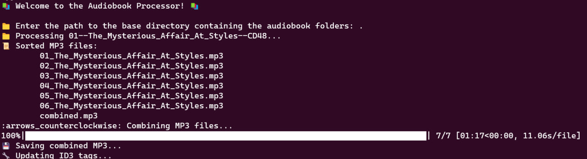

**Audiobook Processor 📚**

**Description 📝**

This Python script takes a folder containing multiple MP3 files and merges them into a single MP3 file. It also reads the ID3 tags from the first input MP3 file and applies them to the merged output file. This is particularly useful for audiobook listeners who prefer to manage their audiobooks as single files, rather than multiple files per book.

**Features 🔥**

- Merges multiple MP3 files into a single MP3 file.
- Reads ID3 tags from the first input file and applies them to the output file.
- Skips already processed audiobook folders to save time and effort.
- Displays progress with the help of emojis and a progress bar for better user experience.
- Provides detailed output information for each processed audiobook.

**Dependencies 📦**

- eyed3
- pydub
- tqdm
- humanfriendly
- emoji

You can install these dependencies using pip:

`pip install eyed3 pydub tqdm humanfriendly emoji`

**How It Works 💻**
    
📁🎧 The script prompts the user to input the path to the base directory containing the audiobook folders.

📂✅ It checks if the specified directory exists. If it doesn't, the script terminates with an error message.

📖📝 The script reads the processed_books.json file to get a list of already processed audiobook folders. If the file doesn't exist, it creates a new empty list.

📂🔁 The script iterates over each folder in the base directory. If a folder is in the processed_books list, it skips it.

🎧🔍 For each audiobook folder, the script does the following:

    - Finds and sorts MP3 files in the folder.
    - Merges the MP3 files into a single combined MP3 file using pydub.AudioSegment.
    - Saves the combined MP3 file in the audiobook folder.
    - Loads the first input MP3 file using eyed3 and reads its ID3 tags (Series Name, Total Runtime, and Reader).
    - Updates the ID3 tags of the combined MP3 file with the information read from the first input file.
    - Adds the folder to the processed_books list and updates the processed_books.json file.

🎉✅ The script displays a success message after processing all audiobook folders.

**Usage 🚀**

Run the script using Python:

`python3 bookbuilder.py`

Input the path to the base directory containing the audiobook folders when prompted. The script will then process each folder and provide detailed output information.

**License 📄**

MIT License
